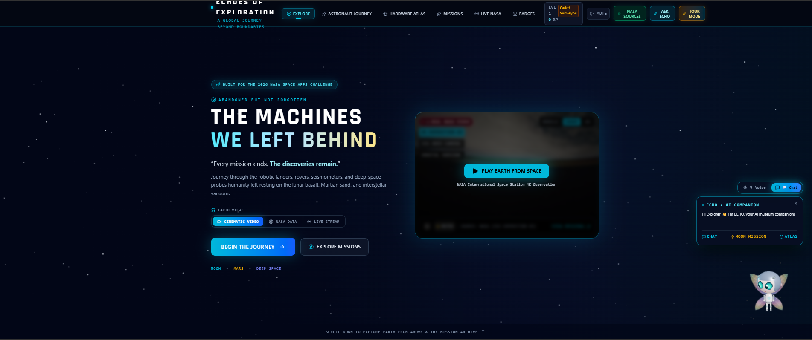
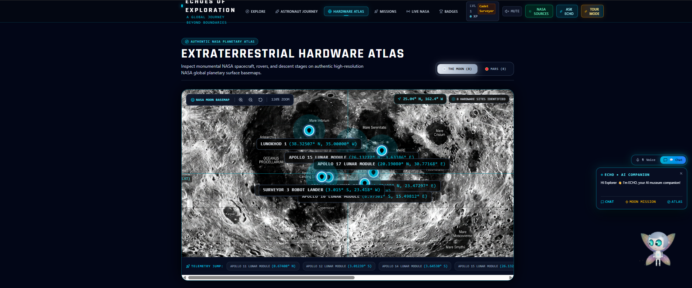
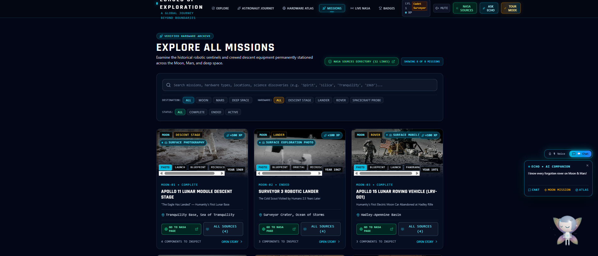
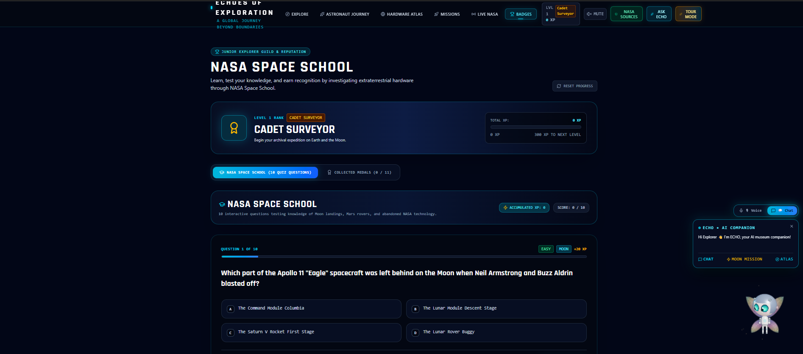
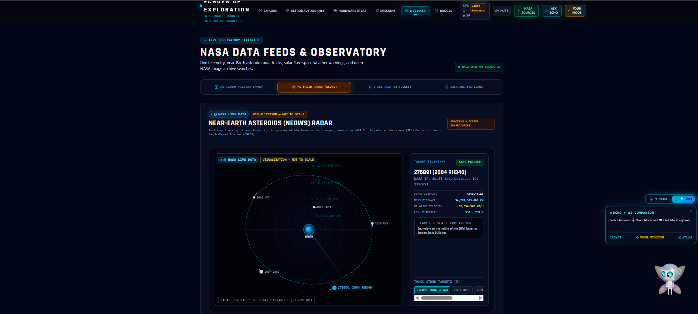

# 🚀 Echoes of Exploration

### The Machines We Left Behind

An AI-powered educational platform that brings NASA's abandoned hardware on the Moon, Mars, and deep space to life through storytelling, interactive exploration, NASA data, and guided learning experiences.

---

## 👥 Team Information

**Team Name:** Team Lost_in_Space

### Team Members

- **Tasnuba Tarannum Taha** — Team Leader, Testing & Voice 
- **Tamim khan shuvo** — Web Developer & Scripting
- **Sabikun Nahar** — UI/UX Designer & Developer
- **Sharmishta Sarker** — Video Editor
- **Sohan Ibn Sahid** — Researcher
- **A B M Sojibur Rahman** — Researcher

---

## 🌐 Live Demo

### Google AI Studio Project

https://ai.studio/apps/fb12cd50-37b3-4ca5-a2b2-27e322f856f8

---

## 🎯 High-Level Summary

Echoes of Exploration is an interactive educational platform developed for the NASA Space Apps Challenge 2026. Inspired by the "Abandoned but Not Forgotten" challenge, the platform helps users discover the stories of spacecraft, landers, rovers, and scientific instruments that remain on the Moon, Mars, and beyond.

Through AI-powered conversations, interactive planetary maps, mission archives, NASA media resources, and gamified learning experiences, users can explore the legacy of these machines and their contributions to scientific discovery.

---

## 🌍 Problem Statement

Many historic NASA spacecraft, landers, rovers, and scientific instruments remain on the Moon, Mars, and throughout deep space. Although these machines played critical roles in scientific discovery, their stories are often hidden within technical archives and difficult for younger audiences and the general public to access.

As a result, much of their educational and historical significance is often overlooked despite their important contributions to space exploration.

---

## 💡 Our Solution

Echoes of Exploration transforms mission archives and NASA data into an engaging digital museum where users can:

- Explore abandoned NASA hardware
- Learn mission histories
- Interact with an AI guide
- View planetary maps
- Access NASA media resources
- Complete educational challenges
- Discover the legacy of historic exploration missions

The platform combines storytelling, AI assistance, interactive visualization, and gamification to make space exploration more engaging and accessible.

---

## ✨ Key Features

### 🤖 Echo AI Companion

Users can interact with Echo through text and voice conversations to learn about NASA missions, abandoned hardware, scientific discoveries, and space exploration topics. Echo can also guide users through different sections of the platform.

### 🛰️ Hardware Atlas

Interactive Moon and Mars maps displaying locations of historic NASA hardware, landers, rovers, and exploration equipment.

### 🚀 Mission Explorer

A searchable archive of historic NASA missions and abandoned equipment featuring mission histories, discoveries, and exploration records.

### 📡 NASA Data Observatory

Integration of NASA open data sources including APOD, NeoWs, DONKI, and NASA Image & Video Library.

### 🎓 NASA Space School

Quiz-based learning experience featuring XP progression, educational challenges, achievement badges, and rank advancement.

### 👨‍🚀 Astronaut Journey

A guided cinematic experience that takes users from Earth orbit into deep space and toward the Moon, helping them understand the scale and context of space exploration.

---

## 🛰️ NASA Open Data Integration

The project utilizes publicly available NASA resources to provide authentic educational content and scientific information.

### NASA Resources Used

- Astronomy Picture of the Day (APOD)
- Near Earth Object Web Service (NeoWs)
- DONKI Space Weather Database
- NASA Image and Video Library
- NASA Mission Archives

### How NASA Data Is Used

NASA data provides imagery, educational resources, mission information, scientific context, and historical records that power the storytelling and exploration experiences throughout the platform.

---

## 📸 Screenshots

### Home Page

### Hardware Atlas

### Mission Explorer

### NASA Space School

### NASA Data Observatory

---

## 🛠️ Technology Stack

### Frontend
- React
- TypeScript
- Vite

### Backend
- Node.js
- Express.js

### AI
- Google Gemini API
- Google AI Studio

### APIs
- NASA Open APIs

### Version Control
- GitHub

---

## 🤖 AI Disclosure

### Tools Used

- Google AI Studio
- Google Gemini API
- ChatGPT

### Purpose

- Application development
- Educational content assistance
- Documentation support
- AI-powered user interaction

All final project decisions, implementation choices, content validation, and design direction were reviewed and refined by team members.

---

## 📚 References

- NASA Image and Video Library
- APOD API
- NeoWs API
- DONKI API
- NASA Mission Archives

---

## 📜 License

This project is released under the Apache 2.0 License.
